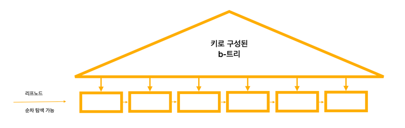
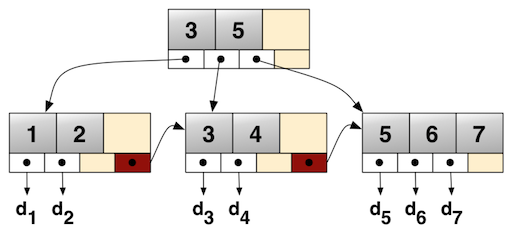

# B+트리(B+Tree)

키만으로 트리를 만들고(B-트리) 리프 노드에 키와 관련된 정보를 저장한다.
모든 키와 데이터가 리프 노드에 저장되어 있으며, 리프 노드들은 연결리스트로 연결된다.

### B-트리와의 차이

B-트리는 모든 노드에 키와 데이터를 저장하지만,
B+트리는 내부 노드에는 키만 저장하고 리프 노드에 모든 키와 데이터를 저장한다.
따라서 B-트리는 루트 노드에서 데이터를 확인하고 끝낼 수도 있는 반면, B+트리는 항상 리프 노드까지 내려가야 데이터를 확인할 수 있다.

형제인 리프 노드를 검색할 때, B-트리는 다시 루트부터 검사해야 하지만,
B+트리는 모든 리프 노드들이 연결리스트로 연결되어 있기 때문에 리프 노드에서 이어서 선형 검색을 수행할 수 있다.
