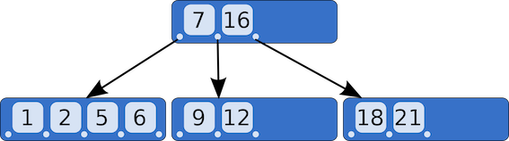

# B-트리(B-Tree)

이진 탐색 트리를 일반화하여, 하나의 노드가 여러개의 key, 여러개의 자식을 가질 수 있게 한 자료구조이다.
부모 노드의 key들은 오름차순으로 정렬되어 있고, 정렬된 순서에 따라 자식 노드들의 key 값의 범위가 결정된다.
모든 리프 노드들이 동일 레벨에 있는 형태로 균형을 유지하고 있다.

## M차 B-트리

- `최대 M개의 자식`을 가질 수 있는 B-트리를 `M차 B-트리`라고 한다.
- `각 노드의 자식의 수`는 `최소 ⌈M/2⌉`, `최대 M` 이다.
- `각 노드의 key 수`는 `최소 ⌈M/2⌉-1`, `최대 M-1` 이다.
- 예외적으로 루트 노드는 최소 조건을 만족시키지 않을 수 있다. 만약 자식이 있다면 자식은 2 이상이다.
- 예외적으로 리프 노드는 자식이 없으므로, 자식 수 조건을 만족시키지 않는다.

## 탐색

탐색할 키와 노드의 키를 비교하여 서브트리로 내려간다.
하나의 노드에 여러개의 키가 존재하기 때문에 노드 내에서는 이진 탐색을 실행한다.

## 삽입

삽입은 항상 리프 노드에서 일어난다.

새로운 키가 저장될 리프 노드를 찾아 키를 저장한다.
노드가 넘치면 가운데 키를 기준으로 노드를 2개로 분리하고 가운데 키는 부모 노드로 승진한다.

## 삭제

삭제는 항상 리프 노드에서 발생한다.

키가 리프 노드에 있다면, 해당 키를 삭제한다.
키가 내부 노드에 있다면, 리프 노드의 가까운 데이터(선임자)와 자리를 교환한 후에 삭제한다.
삭제한 후 키의 개수가 최소 키 수보다 작아지면 *재조정을 한다.

*재조정 과정

- 좌우 형제가 키를 지원해줘도 형제의 키가 최소 키 수 이상이라면 형제로부터 키를 지원받는다.
    - 저장 순서를 유지하기 위해 본인과 형제 사이의 키값을 부모에서 가져오고, 형제의 키값을 부모에게 넘긴다.
- 형제로부터 키의 이동이 불가능할 경우에는 부모의 지원을 받고 형제와 통합된다.
- 부모가 재조정이 필요하면 부모도 재조정한다.

## 시간복잡도

big-O 표기법은 최악의 경우를 고려한다.
최악의 경우는 각 노드가 자식을 단 2개씩만 가질 때이다.
따라서 N개의 노드가 있을 때, B-Tree에서 탐색, 삽입, 삭제에 대한 시간복잡도는 `O(logN)`이다.

## 대용량 데이터베이스에서 사용되는 B-트리

### vs 균형 이진 탐색 트리(예: AVL 트리)

B-트리는 균형 이진 탐색 트리에 비해 적은 레벨 수로 다량의 데이터를 저장할 수 있다.
따라서, 루트 노드에서 리프 노드까지 적은 횟수의 이동만으로 접근할 수 있다는 장점이 있다.

데이터베이스는 주로 secondary storage(SSD, HDD)에 저장되는데,
이 저장 공간은 블럭 단위(4kb, 8kb, 16kb ...)로 데이터를 읽고 쓴다.
균형 이진 탐색 트리는 데이터를 읽어올 때 불필요한 데이터까지 읽어올 확률이 크지만,
B-트리는 연관된 데이터를 모아서 저장하기 때문에 블럭 단위의 저장 공간을 효율적으로 사용할 수 있다.

### vs 해시

해시 인덱스는 삽입/삭제/조회의 시간복잡도가 O(1)이라는 장점이 있지만, equality(=) 조회만 가능하다.
따라서, 범위 기반 검색이나 정렬이 필요한 경우에는 B-트리를 유용하게 사용할 수 있다.
