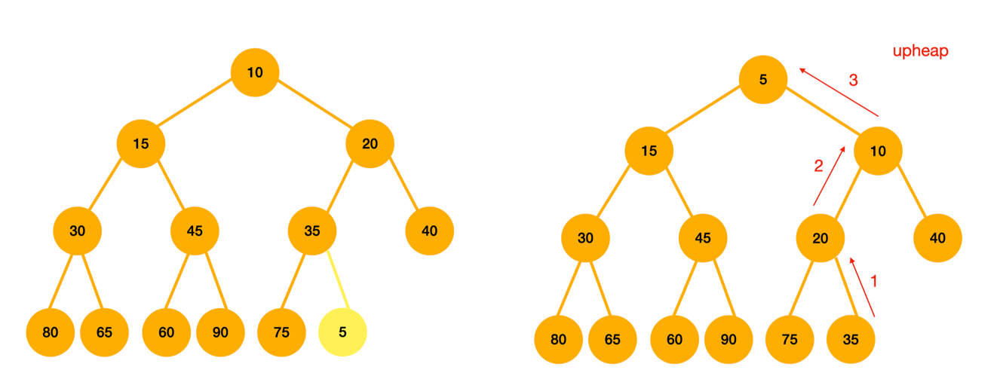

# 이진 힙(Binary Heap)

완전 이진 트리의 일종으로, 부모의 우선순위가 자식의 우선순위보다 높은 자료구조이다.  
우선순위 큐를 구현할 때 사용된다.

- `완전 이진 트리`: 마지막 레벨(제일 아래 부분)을 제외하고 모든 레벨이 완전히 채워져 있는 트리이다. 마지막 레벨은 꽉 차있지 않을 수도 있는데, 노드가 왼쪽부터 채워져야 한다.
- `우선순위 큐`: 우선순위가 높은 데이터가 먼저 나가는 큐이다.

인덱스가 1부터 시작하면 구현할때 편하다.  
부모 노드의 인덱스가 `i`일때, 좌측 자식 노드의 인덱스는 `2*i`, 우측 자식 노드의 인덱스는 `2*i+1`이기 때문이다.  
반대로 자식 노드의 인덱스가 `k`라면 부모 노드의 인덱스는 `k/2`가 된다.

## 이진 힙의 종류

`최소힙(Minimum Heap)`  
노드의 키 값이 작을수록 높은 우선순위를 가진다.

`최대힙(Maximum Heap)`  
노드의 키 값이 클수록 높은 우선순위를 가진다.

## 삭제

이진 힙에서의 삭제 연산은 루트(우선순위가 가장 높음)가 삭제되는 것이다.

1. 루트를 삭제한다.
2. 힙의 가장 마지막 노드를 루트로 옮긴다.
3. 힙 크기를 1 감소시킨다.
4. 힙을 재구성한다.
    - downheap: 자식 노드중 우선순위가 높은 노드와 비교하여 자식 노드가 자신보다 우선순위가 높다면 자식 노드와 키를 교환한다.
    - 힙의 속성이 만족될 때까지 downheap을 반복한다.

## 삽입

1. 힙의 크기를 1 증가시킨다.
2. 마지막 노드에 새로운 원소를 저장한다.
3. 힙을 재구성한다.
    - upheap: 부모 노드와 비교하여 부모 노드가 자신보다 우선순위가 낮으면 부모 노드와 키를 교환한다.
    - 힙의 속성이 만족될 때까지 upheap을 반복한다.

## 시간복잡도

이진 힙의 높이는 log(N+1)이다.
- 각 레벨마다 노드의 수가 2배씩 증가한다.
- N = 1일 경우, 높이는 log2 = 1
- N = 3(1+2)일 경우, 높이는 log4 = 2
- N = 7(1+2+4)일 경우, 높이는 log8 = 3  

삭제, 삽입 연산 자체의 시간복잡도는 O(1)이지만, 힙을 재구성하는 과정에서 최악의 경우 높이만큼(logN)의 연산이 시행될 수 있다.  
-> `삭제, 삽입 연산의 시간복잡도는 O(logN)`

