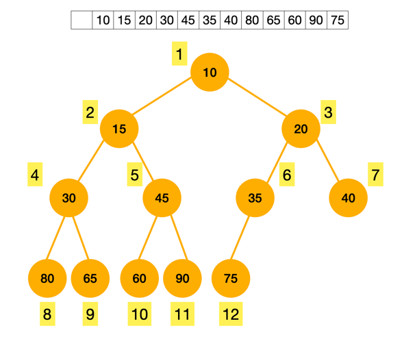
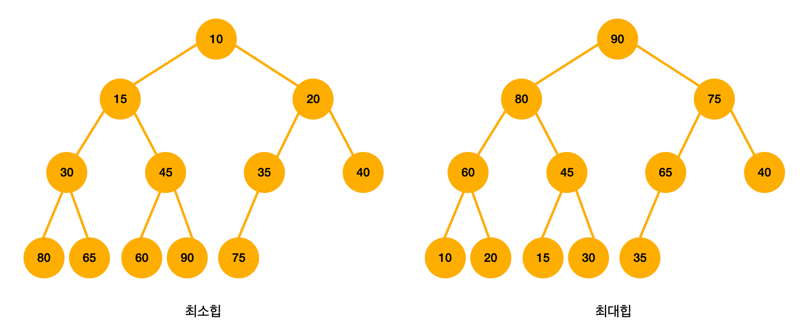

# 이진 힙(Binary Heap)

완전 이진 트리의 일종으로, 부모의 우선순위가 자식의 우선순위보다 높은 자료구조이다.  
우선순위 큐를 구현할 때 사용된다.

- `완전 이진 트리`: 마지막 레벨(제일 아래 부분)을 제외하고 모든 레벨이 완전히 채워져 있는 트리이다. 마지막 레벨은 꽉 차있지 않을 수도 있는데, 노드가 왼쪽부터 채워져야 한다.
- `우선순위 큐`: 우선순위가 높은 데이터가 먼저 나가는 큐이다.

인덱스가 1부터 시작하면 구현할때 편하다.  
부모 노드의 인덱스가 `i`일때, 좌측 자식 노드의 인덱스는 `2*i`, 우측 자식 노드의 인덱스는 `2*i+1`이기 때문이다.  
반대로 자식 노드의 인덱스가 `k`라면 부모 노드의 인덱스는 `k/2`가 된다.  

## 이진 힙의 종류

`최소힙(Minimum Heap)`  
노드의 키 값이 작을수록 높은 우선순위를 가진다.

`최대힙(Maximum Heap)`  
노드의 키 값이 클수록 높은 우선순위를 가진다.  

