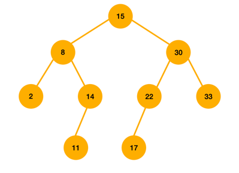
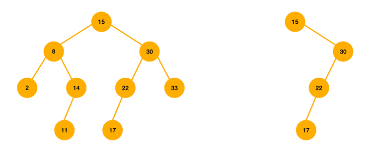

# 이진 탐색 트리(BST, Binary Search Tree)

이진 탐색 트리는 `이진 탐색`의 효율적인 탐색 능력과 `연결리스트`의 자료 삽입, 삭제 능력을 결합한 자료구조이다.

### 조건

`left < node < right`  
각 노드의 왼쪽 서브트리는 해당 노드의 키보다 작은 키를 지닌 노드들을 가지며, 각 노드의 오른쪽 서브트리는 해당 노드의 키보다 큰 키를 지닌 노드들을 가진다. 

## 탐색

루트 노드부터 탐색을 시작하여, 주어진 키와 탐색중인 노드의 키가 같으면 탐색이 성공적으로 끝나게 된다.
`주어진 키 < 노드의 키`라면, 노드의 `왼쪽 자식`을 기준으로 다시 탐색한다.
`주어진 키 > 노드의 키`라면, 노드의 `오른쪽 자식`을 기준으로 다시 탐색한다.

## 삽입

먼저 탐색을 수행하고, 탐색에 실패하나 위치에 새로운 노드를 삽입한다.

### 이미 존재하는 키와 중복된 키를 삽입해야 할 경우?

이건 그냥 궁금해서 찾아봤다.

- 방안1: 오른쪽(또는 왼쪽)에 중복 키를 허용한다.
    - 트리 규칙을 다음처럼 한다.
        - left <= node < right
        - left < node <= right
        - left <= node <= right
            - 효율적인 탐색이 어렵게 됨..
- 방안2: 노드에 count도 저장한다.

[참고1](https://www.geeksforgeeks.org/how-to-handle-duplicates-in-binary-search-tree/)
[참고2](https://stackoverflow.com/questions/300935/are-duplicate-keys-allowed-in-the-definition-of-binary-search-trees)

## 삭제

삭제하는 경우의 수는 3가지이다.

### case1) 삭제하려는 노드가 단말 노드인 경우

단말 노드의 부모 노드를 찾아서 연결을 끊는다.

### case2) 삭제하려는 노드의 자식이 1개인 경우

해당 노드를 삭제하고 서브 트리를 부모 노드에 붙인다.

### case3) 삭제하려는 노드의 자식이 2개인 경우

삭제 노드와 가장 비슷한 값을 가진 노드를 삭제노드 위치로 가져온다.
가장 비슷한 값을 가진 노드는 왼쪽 서브트리의 가장 큰 값과 오른쪽 서브트리의 가장 작은 값중 하나이다.

## 시간복잡도

탐색, 삽입, 삭제의 시간복잡도는 트리의 높이에 비례한다.

트리의 노드의 개수가 N일때,

- 최선의 경우(균형 트리): 높이는 ⌈log(N+1)⌉이므로, `최선의 경우 탐색, 삽입, 삭제의 시간복잡도는 O(logN)`이다.
- 최악의 경우(경사 트리, 한쪽으로만 치우친 트리): 높이는 N이므로, `최악의 경우 탐색, 삽입, 삭제의 시간복잡도는 O(N)`이다.

## 균형 이진 탐색 트리

이진 탐색 트리에서 최악의 경우 시간복잡도가 O(logN)이 되는 문제점을 극복하기 위해 좌우 서브트리의 높이차를 1 이하로 유지한다. 예시로는 AVL 트리, Red-Black 트리가 있다.

