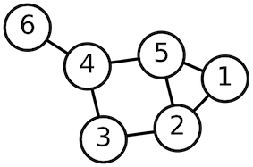
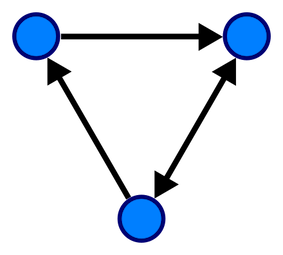
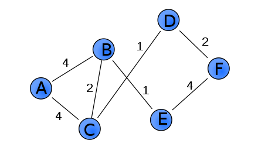
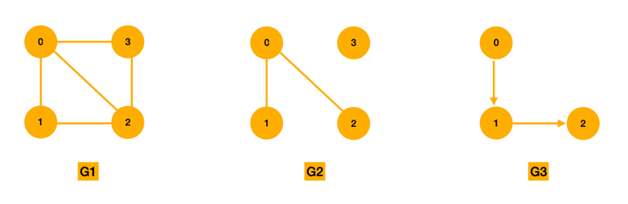

# 그래프(Graph)

그래프는 연결된 객체간의 관계를 정점(vertex)과 간선(edge)을 이용하여 표현하는 자료구조이다.

### 그래프의 예시

대학 강의의 선수과목, 도로망, 지하철 노선도

## 그래프의 종류

### 무방향 그래프(undirected graph)와 방향 그래프(directed graph)

`무방향 그래프(undirected graph)`

- 방향을 갖지 않는 간선을 사용한다.
- 양방향으로 갈 수 있다. 왕복 통행이 가능하다.
- 간선은 (A, B)로 표현한다.



`방향 그래프(directed graph)`

- 방향을 갖는 간선을 사용한다.
- 화살표가 향하는 방향으로만 갈 수 있다. 일방 통행을 의미한다.
- 간선은 <A, B>로 표현한다.



### 가중치 그래프

간선에 비용 또는 가중치가 할당된 그래프이다.



### 연결 그래프

고립된 정점이 없는 그래프이다. 모든 정점 쌍에 대하여 항상 경로가 존재한다. 출발지부터 목적지까지 여러 정점, 간선을 거쳐 도착할 수 있다.

### 트리

사이클을 갖지 않는 연결 그래프이다.

### 완전 그래프

서로 다른 두개의 정점이 반드시 하나의 간선으로 연결된 그래프이다. 모든 정점이 연결되어 있다.

### 밀집 그래프와 희소 그래프

`밀집 그래프(dense graph)`는 간선의 수가 최대 간선의 수에 가까운 그래프이다.
`희소 그래프(sparse graph)`는 간선이 얼마 없는 그래프는이다.

## 용어

- `인접 정점(adjacent vertex)`: 해당 정점에서 간선에 의해 직접 연결된 정점이다.
- `차수(degree)`
    - 무방향 그래프에서는 해당 정점에 연결된 간선의 수이다.
    - 방향 그래프에서는
        - 진입 차수(in-degree): 외부에서 들어오는 간선의 수이다.
        - 진출 차수(out-degree): 외부로 향하는 간선의 수이다.

## 그래프의 표현



```
V(G1)= {0, 1, 2, 3}
E(G1)= {(0, 1), (0, 2), (0, 3), (1, 2), (2, 3)}

V(G2)= {0, 1, 2, 3}
E(G1)= {(0, 1), (0, 2)}

V(G3)= {0, 1, 2}
E(G3)= {<0, 1>, <1, 2>}
```

### 인접 행렬(adjacent matrix)로 그래프 구현

간선 (i, j)가 존재하면 `M[i][j] = 1`을 저장하고, 간선 (i, j)가 존재하지 않으면 `M[i][j] = 0`을 저장한다.
무방향 그래프의 인접 행렬은 대각선이 0이고, 대각선을 기준으로 대칭을 이룬다.

### 인접 리스트로 그래프 구현

해당 정점에서 인접한 정점들을 연결리스트로 표시하는 방법이다.

## 그래프 탐색 방법

하나의 정점에서 시작하여 모든 정점을 방문하기 위한 방법으로는 깊이 우선 탐색과 너비 우선 탐색이 있다.

- `깊이 우선 탐색(DFS, Depth-first search)`
    - 한 방향으로 계속 진행하다가 더 이상 진행이 불가능할 때 가장 최근의 갈림길로 돌아와 다른 방향으로 탐색을 진행하는 방법이다.
    - 스택 또는 재귀 함수를 사용해 구현할 수 있다.
- `너비 우선 탐색(BFS, Breadth-first search)`
    - 시작점에서 가까운 정점을 먼저 다 방문하고, 멀리 있는 정점을 나중에 방문하는 방법이다.
    - 큐를 사용해 구현할 수 있다.
