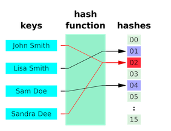
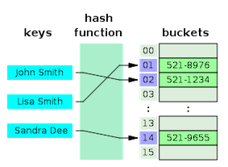

# 해시(Hash)

`해싱(hashing)`은 키 값을 이용해 산술적 연산의 결과로 테이블의 주소를 찾아 데이터에 접근하는 방법이다. 키 값을 비교하여 찾고자 하는 데이터에 접근하는 일반적인 탐색과는 차이가 있다.

## 해시 함수(Hash function)

임의의 길이의 키 값은 해시 함수를 통해 `고정된 길이의 해시 값(hash value)`으로 바뀐다.

해시 값은 해시 테이블(hash table)의 인덱스가 된다.

## 해시 테이블(Hash table)

key-value 구조로 데이터를 저장하는 자료구조이다.
키 값을 해시 함수에 넣어 변환된 해시 값을 통해 테이블의 인덱스에 접근할 수 있다. 데이터가 저장되는 공간은 버킷이라고 한다.

### 해시 테이블의 시간복잡도

해시 테이블은 탐색에 특화된 자료구조로 평균 O(1)의 시간복잡도로 데이터를 탐색, 삽입, 삭제할 수 있다.
단순하게 해시 함수에 키 값을 넣어 도출된 해시 값으로 인덱스에 접근할 수 있기 때문이다.
하지만 해시 충돌이 발생하여 하나의 인덱스에 데이터가 몰려있을 경우 시간복잡도는 O(N)로 증가할 수 있다.

## 해시 충돌(collision)

서로 다른 탐색 키를 해시 함수에 넣었는데 같은 해시 값으로 변환된다면, 충돌이 일어난 것이다.
이상적으로는 충돌을 없애거나 줄이는 것이 좋다. 하지만 현실적으로 생각해보면 해시 테이블의 크기는 제한되어 있기 때문에 해시 함수의 결과 값이 골고루 분포되도록, 해시 충돌이 균등하게 발생하도록 하는 것이 좋다.

### 해시 충돌의 해결책

`체이닝(chaining)`  
각 버킷에 삽입과 삭제가 용이한 리스트를 할당하는 방법이다.
인덱스에 이미 데이터가 있다면, 노드를 체인 형식으로 연결한다.

`개방 주소법(open addressing)`  
충돌이 일어났을 때 비어있는 버킷을 찾아 데이터를 저장하는 방법이다.

- `선형 조사법(linear probing)`
    - 충돌이 일어난 항목을 해시 테이블의 다른 위치에 저장하는 방법이다.
      충돌이 발생했다면 인덱스를 고정 폭만큼 뒤로 움직이며 조사한다.
      테이블의 끝까지 도달하면 테이블 처음부터 다시 조사한다.
      처음 충돌 발생 위치까지 돌아오면 테이블이 가득 찼다는 뜻이다.
    - 선형 조사법에는 특정 영역에 데이터가 몰리는 `군집화(clustering) 문제`가 발생할 수 있다.
      군집화를 해결할 방안으로는 이차 조사법이 있다.
- `이차 조사법(quadratic probing)`
    - 이차 조사법은 다음 조사할 위치를 먼 위치에서 결정하는 것이다.
      충돌이 발생했다면 인덱스를 옮기는 폭을 제곱수만큼 옮겨가며 조사한다.
      선형 조사법의 군집 현상을 완화하긴 하지만, 똑같은 점프 시퀀스가 반복되면 2차 군집화가 이루어질 수 있다.
- `이중 해싱(double hashing)`
    - 해시 충돌이 일어났을 때 별도의 해시 함수를 적용하여 인덱스를 옮기는 폭을 조정하는 방법이다.
      다른 키 값을 이용하기 때문에 다음 인덱스까지 이동해야하는 폭도 달라져, 2차 군집화를 완화할 수 있다.
